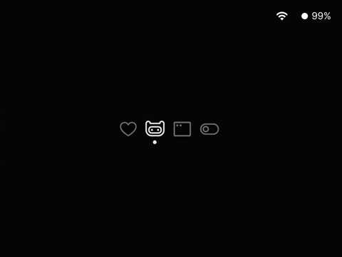
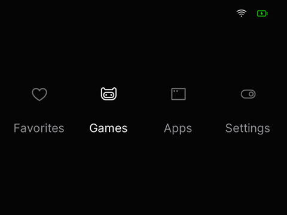

# AnalogPhosphor
A theme for Onion on the Miyoo Mini (+)

## Why
I wanted a really minimal theme and there wasn't really one that was perfect for me. And there still isn't. I'm a cronic theme switcher, but I figured I'd give back to the community that has made so many beautiful themes.

## Icons
The main icons for this theme are from [Phosphor Icons](https://phosphoricons.com/). A beautiful opensource icon set.
The console icons I stole from [Shallot](https://github.com/OnionUI/Themes/tree/main?tab=readme-ov-file#shallot-by-cyberbellum) by Cyberbellum

## Included PSD
I've included the PSD file that I've been working off of. Feel free to play around with it, mod it, and release it. Just please credit everyone. :D

This is a very early work in progress. As such there are some images from other themes currently as I was using them as templates to start off of. I'll be updating them eventually and I'll add it to the [Onion Theme Repo when it's done](https://github.com/OnionUI/Themes/blob/main/README.md). :D

## AnalogPhosphor

### Note:
Normal AnalogPhosphor only works if you don't have "Recents" and "Expert" enabled.
I'm working on a version with all the icons enabled but the images are shifting weird currently.
If you need a version with these options enabled, AnalogPhosphor OG has evrything you need, just with the default Miyoo Mini homescreen spacing.

Feel free to edit the theme to your needs as well. 

## AnalogPhosphor OG

