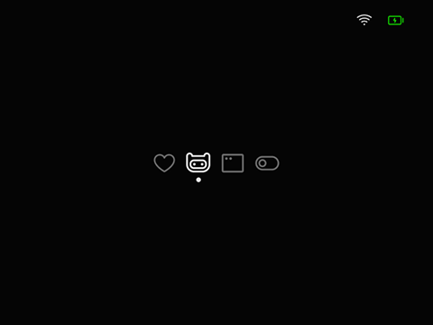

# AnalogPhosphor

A theme for Onion on the Miyoo Mini (+)

## Why

I wanted a really minimal theme and there wasn't really one that was perfect for me. And there still isn't. I'm a cronic theme switcher, but I figured I'd give back to the community that has made so many beautiful themes.

This is a very early work in progress. As such there are some images from other themes currently as I was using them as templates to start off of. I'll be updating them eventually and I'll add it to the [Onion Theme Repo when it's done](https://github.com/OnionUI/Themes/blob/main/README.md). :D

> [!IMPORTANT]
> This theme ***WILL NOT*** work with the Recent and Expert folders enabled. The images will shift weird and not line up correctly. This seems to be a problem with the Miyoo Mini firmware and I haven't been able to find a way around that.  
If you use Recent or Expert folders on your device, you **CAN** use AnalogPhosphorOG as this theme uses the original Miyoo Mini Homepage icon sizes.  
Sorry if this doensn't work for you, there just isn't any way around it. I will not respond to any issues regarding this problem. You have been warned. 

## AnalogPhosphor

## AnalogPhosphor (Alt Icon)

## AnalogPhosphor OG

## Boot Logo

## Power Off

## Save and Power Off

## A couple more screens

## Included PSD

I've included the PSD file that I've been working off of. Feel free to play around with it, mod it, and release it. Just please credit everyone. :D

# Credits

The main icons are from [Phosphor Icons](https://github.com/phosphor-icons/homepage)  
Console icons are from [openFPGA](https://github.com/spiritualized1997/openFPGA-Platform-Art-Set). (Originally made for the Analogue Pocket)  
The font is [Inter](https://github.com/rsms/inter)
